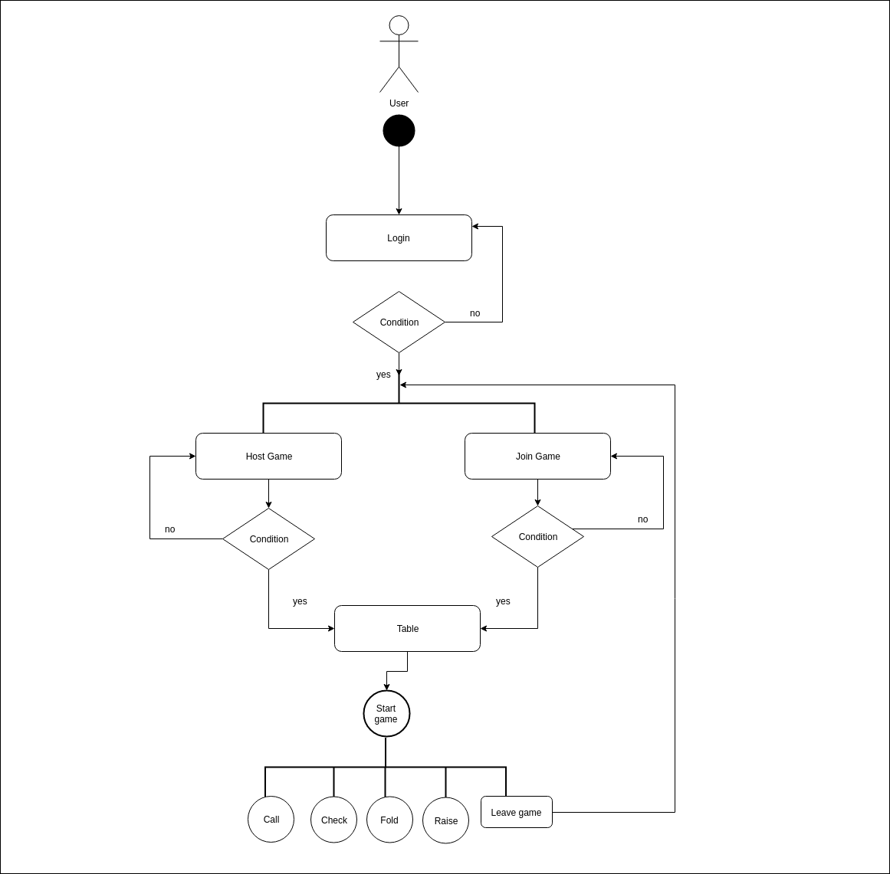
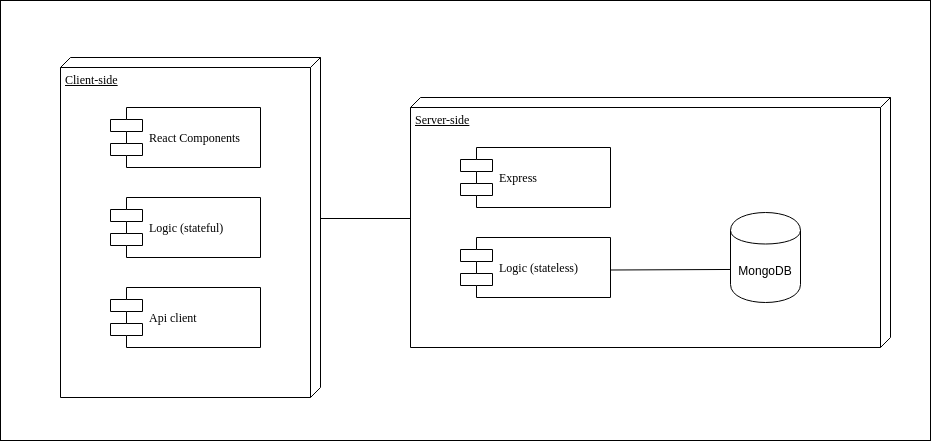
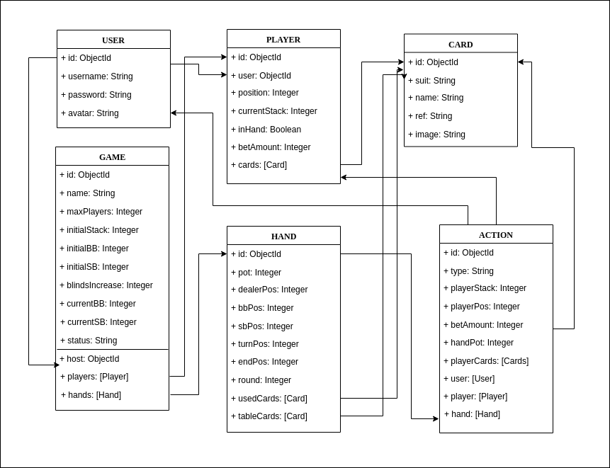
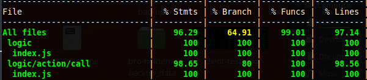
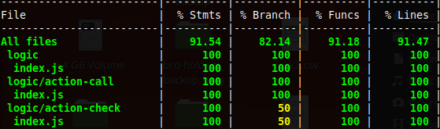

# Bro Holdem

## Introduction
Bro Holdem is a platform that allows users to host and join real-time online poker games. 

It aims to provide a more convenient way to play poker without all the hustle of face-to-face games, such as: card dealing, turn time and chips arrangement.

[Demo (Desktop)](https://bro-holdem.surge.sh/)

## Functional description
[Wireframes](bro-holdem-doc/images/functional-description)

Registered users can:

* Host a game and set up game rules.
* Join a game with a token.
* Start game when table is ready.
* Check, call, raise or fold cards in each round.
* Leave game.

### Use Cases

### Flowcharts

## Technical Description
### Blocks

### Components

### Data Model

### Code Coverage
\
\
\
\
### Technologies
Javascript, ReactJS, Node.js, Express, MongoDB, Mongoose, SASS.
Testing: Jest & Mocha/Chai

## TODO
* Mobile version: Ionic?
* Create lobby of poker games
* More dynamic interaction with table events
* Custom prize distribution
* Play against AI
* Player stats using action records

